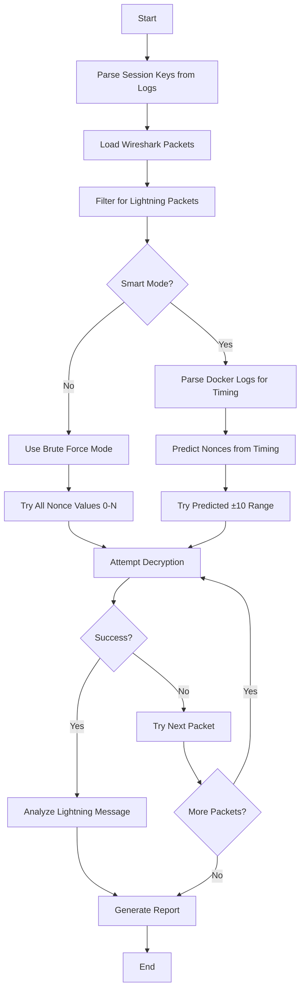

# Lightning Network Packet Decryption Tool Documentation

## Overview

`brute_force_smart.go` is a sophisticated cryptanalysis tool designed to decrypt Lightning Network packets captured from network traffic. It implements the Brontide encryption protocol used by Lightning Network nodes and provides both brute force and intelligent nonce prediction methods for decryption.

## Table of Contents

1. [Architecture Overview](#architecture-overview)
2. [Core Components](#core-components)
3. [Decryption Workflow](#decryption-workflow)
4. [Key Algorithms](#key-algorithms)
5. [Usage Examples](#usage-examples)
6. [Technical Deep Dive](#technical-deep-dive)

## Architecture Overview

The tool follows a layered architecture:

```
┌─────────────────────────────────────────┐
│               Main Entry Point           │
├─────────────────────────────────────────┤
│          Session Key Parsing            │
├─────────────────────────────────────────┤
│         Packet Filtering System         │
├─────────────────────────────────────────┤
│        Decryption Engine (Core)         │
├─────────────────────────────────────────┤
│     Smart Nonce Prediction (Optional)   │
├─────────────────────────────────────────┤
│      Lightning Message Analysis         │
└─────────────────────────────────────────┘
```

## Core Components

### 1. SessionState Structure
```go
type SessionState struct {
    Role        string   // "initiator" or "responder"
    ChainingKey [32]byte // From handshake
    SendKey     [32]byte // Initial send cipher key
    RecvKey     [32]byte // Initial recv cipher key
    SendSalt    [32]byte // Send cipher salt
    RecvSalt    [32]byte // Recv cipher salt
    SendNonce   uint64   // Current send message counter
    RecvNonce   uint64   // Current recv message counter
}
```

**Purpose**: Maintains the complete cryptographic state for a Brontide session. This includes:
- **Role**: Whether the node is the connection initiator or responder
- **Keys**: ChaCha20-Poly1305 encryption keys derived from the handshake
- **Salts**: HKDF salts used for key rotation
- **Nonces**: Message counters that increment with each encrypted message

### 2. BrontideDecryptor Class

The main decryption engine that handles:
- **Key Rotation**: Automatically rotates keys every 1000 messages using HKDF
- **Bidirectional Decryption**: Handles both SEND and RECV directions
- **Nonce Management**: Tracks and predicts nonce values
- **Message Validation**: Verifies decrypted content is valid Lightning data

### 3. Packet Processing Pipeline

```
Raw Wireshark JSON → Parse → Filter → Deduplicate → Validate → Decrypt → Analyze
```

#### Filtering Stages:
1. **Size Filtering**: Lightning messages are minimum 18 bytes (2-byte length + 16-byte auth tag)
2. **Entropy Analysis**: Encrypted data should have high entropy (≥6.5)
3. **Pattern Recognition**: Looks for encryption patterns and uniformity
4. **Cryptographic Validation**: Attempts actual decryption to confirm Lightning packets

## Decryption Workflow

### Main Process Flow



### 1. Session Key Extraction

The tool parses log files to extract cryptographic material:

```go
func ParseSessionFromLogs(logContent string) (*SessionState, error)
```

**What it extracts**:
- Chaining key from the handshake process
- Send/Recv cipher keys (32 bytes each)
- Send/Recv cipher salts (32 bytes each)
- Node role (initiator/responder)

**Log patterns it searches for**:
- `"final chaining key":`
- `"send cipher key":`
- `"recv cipher key":`
- `"send cipher salt":`
- `"recv cipher salt":`

### 2. Packet Filtering System

#### Stage 1: Basic Validation
```go
func isLightningPacket(payload []byte) bool
```

Uses heuristic analysis:
- **Size Analysis**: Common Lightning message sizes (18, 90-116, 1475 bytes)
- **Entropy Calculation**: Measures randomness (encrypted data has high entropy)
- **Byte Distribution**: Checks for uniform distribution typical of encrypted data
- **Pattern Matching**: Looks for encryption artifacts

#### Stage 2: Cryptographic Validation
```go
func (bd *BrontideDecryptor) validateLightningPackets(candidates []ProcessedPacket) []ProcessedPacket
```

Attempts actual decryption on a sample of packets:
- If >50% decrypt successfully → Use strict cryptographic validation
- If 10-30% decrypt → Use hybrid validation (crypto + heuristic)
- If <10% decrypt → Fall back to heuristic-only (possible wrong keys)

### 3. Decryption Engine

#### Key Rotation Algorithm
```go
func (bd *BrontideDecryptor) RotateKey(oldKey, salt [32]byte) ([32]byte, [32]byte)
```

Lightning Network rotates encryption keys every 1000 messages using HKDF:
1. Take current key and salt
2. Use HKDF-SHA256 to derive new salt and key
3. Apply this rotation for every 1000 nonce increments

#### Nonce Management
```go
func (bd *BrontideDecryptor) getCurrentKeyForNonce(nonce uint64, isRecv bool) ([32]byte, [32]byte, error)
```

- Nonces are 64-bit counters that increment with each message
- Key rotation happens every 1000 messages: `rotations = nonce / 1000`
- Actual nonce used in ChaCha20 is: `nonce % 1000`

#### Bidirectional Testing
```go
func (bd *BrontideDecryptor) TryDecryptPacket(ciphertext []byte, startNonce, maxTries uint64) ([]byte, uint64, bool, error)
```

The tool tries both key configurations because:
- Packet captures contain traffic from BOTH sides of the connection
- One side uses SEND keys, the other uses RECV keys
- We don't know which direction each captured packet represents

**Testing Strategy**:
1. **NORMAL mode**: Use RECV keys for "received" packets, SEND keys for "sent" packets
2. **SWAPPED mode**: Use SEND keys for "received" packets, RECV keys for "sent" packets

## Key Algorithms

### 1. Smart Nonce Prediction

```go
type SmartNoncePredictor struct {
    Events      []NonceEvent
    CurrentSend uint64
    CurrentRecv uint64
    StartTime   time.Time
    Enabled     bool
}
```

**How it works**:
1. Parse Docker logs for nonce increment events
2. Extract timestamps and nonce values
3. Use linear interpolation to predict nonce at packet capture time
4. Try predicted nonce ±10 range instead of brute forcing thousands

**Advantages**:
- Reduces decryption time from minutes to seconds
- More accurate for long-running sessions
- Handles key rotations automatically

### 2. Brute Force Mode

**Strategy**: Try every nonce from 0 to maxNonce (typically 5000-15000)

**Optimizations**:
- Test both SEND and RECV directions
- Test both NORMAL and SWAPPED key assignments
- Extend range for large packets (likely fragmented)
- Early termination on successful decryption

### 3. Message Validation

```go
func (bd *BrontideDecryptor) isValidDecryption(plaintext []byte) bool
```

**Validation criteria**:
1. **Length Check**: Must be ≥2 bytes (for message type)
2. **Message Type**: Must be valid Lightning message type (0-65535)
3. **Size Consistency**: Message length must match remaining payload
4. **Protocol Validation**: Check against known Lightning message types

**Known Lightning Message Types**:
- `16`: init
- `17`: error  
- `18`: ping
- `19`: pong
- `32`: open_channel
- `33`: accept_channel
- `256`: update_add_htlc
- And many more...

## Usage Examples

### Basic Usage (Brute Force)
```bash
go run brute_force_smart.go session.log packets.json 5000
```

### Smart Mode with Docker Logs
```bash
go run brute_force_smart.go session.log packets.json smart docker_log.log
```

### High-Volume Analysis
```bash
go run brute_force_smart.go session.log packets.json 15000
```

## Technical Deep Dive

### ChaCha20-Poly1305 Implementation

The tool uses Go's `golang.org/x/crypto/chacha20poly1305` package:

```go
aead, err := chacha20poly1305.New(key[:])
if err != nil {
    return nil, fmt.Errorf("failed to create cipher: %v", err)
}

plaintext, err := aead.Open(nil, nonceBytes[:], ciphertext, nil)
```

**Key Details**:
- **Key Size**: 32 bytes (256 bits)
- **Nonce Size**: 12 bytes (96 bits)
- **Authentication Tag**: 16 bytes (automatically handled)
- **Nonce Format**: 4 zero bytes + 8-byte little-endian counter

### HKDF Key Derivation

Used for key rotation every 1000 messages:

```go
h := hkdf.New(sha256.New, oldKey[:], salt[:], info)
h.Read(newSalt[:])    // 32 bytes
h.Read(nextKey[:])    // 32 bytes
```

**Parameters**:
- **Hash Function**: SHA-256
- **Input Key Material**: Previous key (32 bytes)
- **Salt**: Previous salt (32 bytes)  
- **Info**: Empty (no additional context)
- **Output**: New salt (32 bytes) + New key (32 bytes)

### Entropy Calculation

```go
func calculateEntropy(data []byte) float64
```

Uses Shannon entropy formula:
```
H(X) = -Σ P(xi) * log2(P(xi))
```

Where P(xi) is the probability of byte value xi occurring in the data.

**Expected Values**:
- Random/encrypted data: ~7.8-8.0 bits
- Compressed data: ~6.0-7.5 bits
- Plain text: ~4.0-6.0 bits
- Highly structured data: <4.0 bits

### Performance Characteristics

**Brute Force Mode**:
- Time complexity: O(n) where n = max nonce range
- Typical range: 5,000-15,000 nonces per packet
- Average time: 1-5 seconds per packet

**Smart Prediction Mode**:
- Time complexity: O(1) - constant time with small margin
- Typical range: ±10 nonces around prediction
- Average time: <100ms per packet

**Memory Usage**:
- Session state: ~200 bytes
- Packet buffer: Variable (depends on capture size)
- Docker log events: ~50 bytes per event

## Output and Analysis

### Decrypted Message Analysis

For each successfully decrypted packet, the tool provides:

1. **Message Identification**:
   - Lightning message type (numeric and name)
   - Message category (Setup, Channel, Payment, etc.)
   - Message size and structure

2. **Cryptographic Details**:
   - Successful nonce value
   - Key direction used (SEND/RECV)
   - Key configuration (NORMAL/SWAPPED)

3. **Content Analysis**:
   - Hex dump of decrypted content
   - ASCII extraction for readable portions
   - Protocol-specific field parsing (for known message types)

### Success Rate Analysis

The tool calculates and reports:
- Overall decryption success rate
- Per-message-type statistics
- Performance metrics (time per packet)
- Key effectiveness (which key directions work)

### Error Handling and Diagnostics

**Common Issues and Solutions**:

1. **Low Success Rate (<10%)**:
   - Wrong session keys for this capture
   - Incorrect node role assignment
   - Mixed traffic from multiple node pairs

2. **No Successful Decryptions**:
   - Completely wrong keys
   - Capture doesn't contain Lightning traffic
   - Severe clock synchronization issues

3. **Partial Success (10-50%)**:
   - Some packets from other connections
   - Key rotation boundary issues
   - TCP fragmentation problems

## Security Considerations

**Important Notes**:

1. **Key Material**: This tool requires access to actual session keys, which are normally kept secret
2. **Traffic Analysis**: Even encrypted, packet timing and sizes reveal information
3. **Legal/Ethical**: Only use on your own Lightning nodes or with explicit permission
4. **Data Sensitivity**: Decrypted Lightning messages may contain financial information

## Future Enhancements

**Potential Improvements**:

1. **Multi-Session Support**: Handle captures with multiple node pairs
2. **Real-Time Analysis**: Process live packet streams
3. **Machine Learning**: Improve packet classification accuracy
4. **GUI Interface**: Web-based analysis dashboard
5. **Protocol Updates**: Support for newer Lightning protocol versions

## Troubleshooting

### Common Problems

**"No Lightning packets found"**:
- Check if the JSON export contains TCP payload data
- Verify the capture includes the correct port (usually 9735)
- Ensure Lightning traffic was actually captured

**"Failed to decrypt with any key configuration"**:
- Verify session keys are from the same session as the capture
- Check if the capture time matches the session time
- Try increasing the max nonce range

**"Very low decryption rate"**:
- Confirm the node role (initiator vs responder) is correct
- Check for clock synchronization issues
- Verify the capture doesn't contain mixed traffic from multiple nodes

### Debug Output

The tool provides extensive logging to help diagnose issues:
- Detailed nonce prediction information
- Key rotation calculations
- Packet filtering decisions
- Decryption attempt results

All output is logged both to console and to a timestamped log file for later analysis.